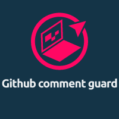

# Commit Message Hook Generator for VS Code

This VS Code extension allows you to easily generate a pre-commit hook for validating commit messages based on specified patterns.

## Features

- Interactive command to set up commit message patterns.
- Automatically creates a pre-commit and msg-commit hooks.
- Validates commit messages against required and task patterns.
- Provides an example of a valid commit message for reference.

## How to Use

1. Open a VS Code workspace.
2. Navigate to the file where you want to set up the commit message hook.
3. Run the "Create Commit Msg Hook" command using the VS Code command palette.
4. Follow the prompts to enter the required pattern, task pattern, and an example of a valid commit message.
5. The extension will update the file with the specified patterns and create the necessary hooks.

## Requirements

- Node.js version 10.22.0 or higher.
- Husky should be installed in the project. If not, the extension will guide you through the installation process.

## Installation

1. Install the extension from the Visual Studio Code marketplace.
2. Open your VS Code workspace.
3. Run the "Create Commit Msg Hook" command to set up the hook.

## Configuration

- The extension supports customization of required patterns, task patterns, and example commit messages.

## Issues and Feedback

If you encounter any issues or have feedback, please create an issue on the [GitHub repository](link-to-your-repository).

## Contribution

Contributions are welcome! Fork the repository, make your changes, and submit a pull request.